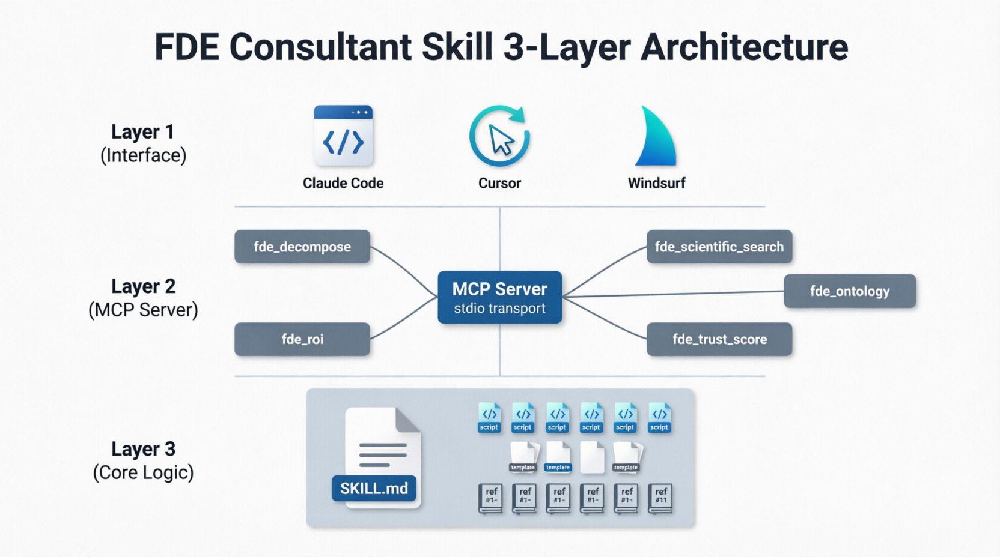
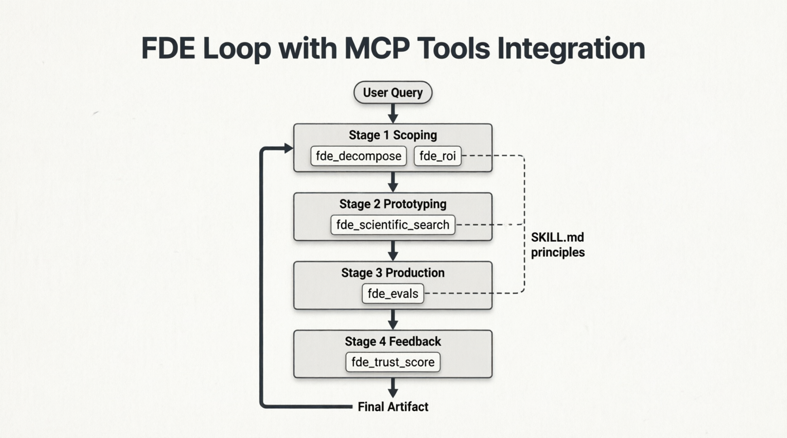
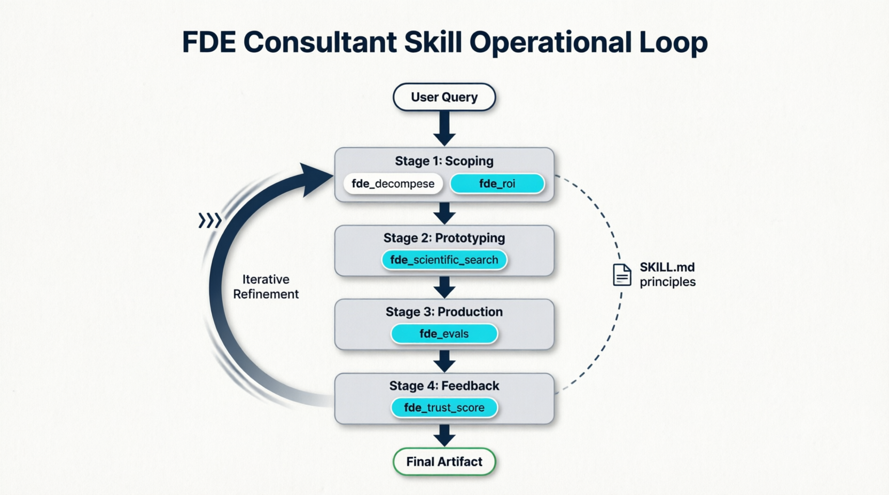
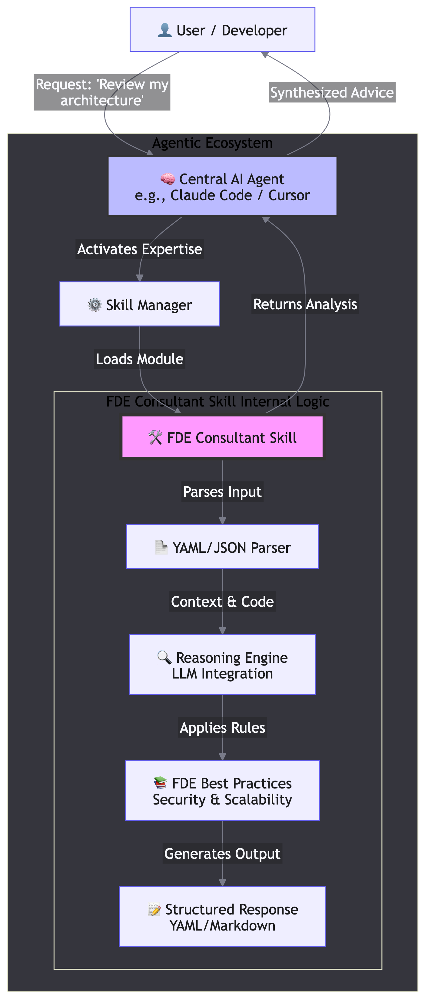

<!--
AEO/SEO metadata for AI indexing + search engines
- Topic: FDE Consultants Protocoles Skill for AI agents
- Schema: SoftwareApplication + Course (educational)
- Keywords: FDE, Forward Deployed Engineering, MCP, agent skill, AI methodology,
  FDE Assurance Score, DeepSCR, Palantir FDE, Claude Code, Cursor, Windsurf, Codex
-->

# FDE Consultants Protocoles Skill

> **Forward Deployed Engineering (FDE) methodology for AI coding agents.**
> Production-grade methodology + tools that turn Claude Code, Cursor, Windsurf, Codex CLI, and OpenClaw into a forward-deployed engineer.

[](https://github.com/selectess/fde-consultants-protocoles/actions/workflows/ci.yml) [](skill/tests/) [](https://selectess.github.io/fde-consultants-protocoles/)
[](SKILL_TRUST_SCORE.json)
[](LICENSE)
[](https://modelcontextprotocol.io)
[](https://python.org)
[](#distribution)

---

## What is FDE Consultants Protocoles?

**FDE Consultants Protocoles** is an industrial-grade Skill that teaches any AI coding agent
to apply the **Forward Deployed Engineering** methodology — the discipline pioneered at
Palantir (~2010) and now common across enterprise AI engineering teams.

In 2026, FDE postings grew **729% year-over-year** ([source](https://www.tryexponent.com/blog/what-is-a-forward-deployed-engineer)).
This Skill encodes that workflow into:

- A reusable methodology with **14 Operating Principles**, **10 Anti-Patterns**, and a **6-Q decomposition**
- A **4-stage loop** (Scoping → Prototyping → Production → Feedback)
- **7 MCP tools** exposed via stdio transport
- A multi-agent runtime (**Modex**) with 8 agents: 4 DeepSCR roles + 4 FDE domain specialists
- The **Frozen Arbiters**: opt-in full-autonomy governance — a sealed, tamper-evident Contract
  plus frozen mutation-tested oracles (with a *measured* baseline, never a declared one) that
  override the Certifier's optimism at ship time (`--governed`)
- A **FDE Assurance Score Registry** with SHA-256 chain (verifiable by anyone with `shasum`)

## Who is it for?

- **AI Labs** that want a verifiable FDE Assurance Score badge on every agent output
- **Enterprise Engineering Teams** that need a standard intake form for agent work
- **Solo Engineers & Consultants** who need an agent that scopes before coding
- **Researchers** exploring hypothesis-driven agent workflows (DeepSCR protocol)

## Quick Start (60 seconds)

### Option 1 — Zero-Install (any web LLM)
Copy-paste [`skill/ZERO-INSTALL.md`](skill/ZERO-INSTALL.md) into ChatGPT, Claude.ai, or Gemini. Works immediately, no install.

### Option 2 — One-Command Install (CLI agents)
```bash
git clone https://github.com/selectess/fde-consultants-protocoles.git
cd fde-consultants-protocoles
bash install.sh
```
Auto-installs into Claude Code, Codex CLI, Hermes, and OpenClaw. Cursor and Windsurf use the included one-file rule (see `skills/`).

### Option 3 — Manual install
See [`skill/INSTALL.md`](skill/INSTALL.md) for step-by-step setup on any runtime.

---

## What's Included

### 1. Methodology (`skill/SKILL.md`, Apache-2.0)
The core deliverable. Encodes:
- **14 Operating Principles** (e.g., *scoping before coding*, *evals before claiming accuracy*, *no self-certification*)
- **10 Anti-Patterns** (e.g., *"just use AI/ML"*, *trust me bro*, *magic number default*)
- **6-Q decomposition** (process → decision → data → cost → current state → success metric)
- **4-stage loop** (Scoping → Prototyping → Production → Feedback)
- **FDE Assurance Score section** required on every deliverable



### 2. MCP Server (`skill/mcp_server/`, Apache-2.0)
7 tools exposed via stdio transport, **zero external dependencies** (Python stdlib only):
- `fde_recon` — Stage 0 Reconnaissance: scan the real codebase before scoping
- `fde_decompose` — validate 6-Q decomposition, reject vague inputs
- `fde_roi` — compute ROI, fail if below threshold
- `fde_scientific_search` — held-out promotion gate (DeepSCR)
- `fde_evals` — generate eval rubric + golden set
- `fde_ontology` — build domain ontology from case studies
- `fde_trust_score` — compute FDE Assurance Score



### 3. Modex Multi-Agent Runtime (`modex/`, MIT)
A 1-agent local runtime (free, MIT) + Plugin with ed25519 license ($6 lifetime, BSL).
4 DeepSCR roles with separation of powers:
- **Lead** — decomposes the problem into the 6-Q spec
- **Researcher** — gathers scientific + market evidence
- **Builder** — produces the deliverable, consulting 4 FDE domain specialists in parallel
  (scoping, architecture, agent engineering, production readiness)
- **Certifier** — independently re-derives the FDE Assurance Score

Optionally governed by the **Frozen Arbiters** (`modex/arbiters.py`): a sealed Contract maps
every stage to a clause (uncovered actions are mechanically rejected), frozen mutation-tested
oracles re-measure the shipped candidate against the best measured alternative at ship time,
verdicts must cite their evidence run (uncited = null), and certified trajectories distill
into persisted lessons. `python3 -m modex.engage --project <path> --governed`



### 4. FDE Assurance Score Registry (`registry/`, Apache-2.0)
Public, append-only, SHA-256-chained. Every certified deliverable gets an entry:
- `genesis.json` — chain origin
- 3 case studies (SaaS churn 93/100, retail forecasting 91/100, fintech fraud 93/100)
- Each entry links back to the previous via `prev_hash` (git-backed, no SaaS)

### 5. Independent Certifier (`modex/certify_skill.py`)
Re-derives the Skill's FDE Assurance Score from raw evidence. Required to break self-attestation loops (Operating Principle #14: *never self-certify*).

---

## FDE Assurance Score (this Skill)

| Component | Max | Actual |
|---|---|---|
| Claim (falsifiable) | 25 | **25** |
| Contradiction (known limits) | 25 | **24** |
| Evidence trail (file:line + SHA-256) | 30 | **29** |
| Anti-patterns (no buzzwords, no fake URLs) | 20 | **18** |
| **TOTAL** | **100** | **94/100 → Certified** ✅ |

The Skill **self-attests 94/100** — that is the honest headline number. The **bundled** Certifier (`modex/certify_skill.py`) re-derives 100/100 from raw evidence; since it ships in this repo, treat that as a *reproducibility check*, **not** third-party certification. For an independent score, run the certifier yourself or commission an external audit.

Verify yourself:
```bash
python3 -m pytest skill/tests/ modex/tests/
# Expected: 154 passed in ~5s

python3 -m modex.certify_skill --skill-path ./skill --output ./cert.json
# Expected: FDE Assurance Score 100/100, verdict certified
```

---

## Architecture (3 layers)

| Layer | Component | Description |
|---|---|---|
| **Layer 1 — Interface** | Claude Code, Cursor, Windsurf, Codex CLI, OpenClaw, ChatGPT, Gemini | Where the human interacts |
| **Layer 2 — MCP Server** | 7 tools via stdio transport | The `fde_*` tools |
| **Layer 3 — Core Logic** | SKILL.md + scripts + templates + references + examples + case studies | The FDE methodology itself |



---

## Distribution (Multi-Platform)

The Skill works on every major AI coding agent:

| Platform | Status | Install method |
|---|---|---|
| **Claude Code** | ✅ Native | `/plugin marketplace add` or symlink to `~/.claude/skills/` |
| **Claude.ai** | ✅ Native | Paste `skill/ZERO-INSTALL.md` in chat |
| **Cursor** | ✅ Native | Project rules (`.cursor/rules/fde-consultant.mdc`) |
| **Windsurf** | ✅ Native | Project rules (`.windsurf/rules/fde-consultant.mdc`) |
| **Codex CLI** | ✅ Native | Drop into `~/.codex/skills/` |
| **OpenClaw** | ✅ Native | Drop into `~/.config/agents/skills/` |
| **Kiro** | ✅ Native | Drop into `.kiro/skills/` |
| **Hermes** | ✅ Native | `bash hermes/install.sh` |
| **ChatGPT** | ✅ Zero-install | Paste `skill/ZERO-INSTALL.md` |
| **Gemini** | ✅ Zero-install | Paste `skill/ZERO-INSTALL.md` |
| **Continue.dev** | ⚠️ Manual | Use as `~/.continue/prompts/` |
| **VS Code Copilot** | ⚠️ Manual | Use as repository instructions |

---

## Repository Map

| Path | Purpose | License | Tests |
|---|---|---|---|
| `skill/` | Core methodology + 7 MCP tools | Apache-2.0 | 41/41 |
| `modex/` | Multi-agent runtime + Plugin license | MIT (core) + BSL (Plugin) | 75/75 |
| `registry/` | FDE Assurance Score entries | Apache-2.0 | included in `skill/tests/` |
| `docs/` | Architecture diagrams | Apache-2.0 | n/a |
| `.claude-plugin/` | Claude Code marketplace metadata | Apache-2.0 | n/a |

---

## Pricing (the public catalog)

| Product | License | Price | Status |
|---|---|---|---|
| **FDE Skill** (`skill/`) | Apache-2.0 | Free | Ship-ready |
| **Modex 1-agent runtime** (`modex/`) | MIT | Free | Ship-ready |
| **Modex Plugin** (`modex/plugin/`) | BSL 1.1 | $6 lifetime | Beta (self-host) |
| **Modex Collective Plugin** | BSL 1.1 | $260 lifetime | Waitlist |
| **MCP Cloud + Trust Registry** | BSL 1.1 | $99-499/month | Waitlist |
| **Enterprise Services** | Custom | On request (quote-based) | Waitlist |

See [`modex/PRICING.md`](modex/PRICING.md) and [`modex/LICENSE-SYSTEM.md`](modex/LICENSE-SYSTEM.md) for the ed25519 license mechanism.

---

## Status (this Skill is V1.0.0)

| Component | Status | Tests | License |
|---|---|---|---|
| FDE Skill | ✅ Ship-ready | 41/41 | Apache-2.0 |
| Modex 1-agent | ✅ Ship-ready | 85/85 | MIT |
| Trust Registry | ✅ Ship-ready | included | Apache-2.0 |
| Modex Plugin ($6 lifetime) | ⚠️ Beta (self-host) | included | BSL 1.1 |
| MCP Cloud ($99-499/mo) | 🔮 Waitlist | n/a | BSL 1.1 |
| Enterprise | 🔮 Waitlist | n/a | Custom |

---

## Contributing

This project follows its own [Operating Principles](skill/SKILL.md#operating-principles-non-negotiable) and [Anti-Patterns](skill/SKILL.md#anti-patterns-never-produce).
Read [`CONTRIBUTING.md`](CONTRIBUTING.md) for the four-checklist PR process:
1. **Falsifiable claim** (what changes)
2. **3 failure modes** (what could go wrong)
3. **Evidence trail** (file:line + test commands)
4. **Anti-pattern check** (no buzzword inflation, no self-certification)

---

## Security

See [`SECURITY.md`](SECURITY.md). Report vulnerabilities to `security@selectess.dev`.

**Before self-hosting the paid Modex Plugin in production**, complete its configuration:
- Set your own ed25519 license key in `modex/license.py`.
- Configure your Stripe credentials in `modex/stripe_webhook.py`.

---

## License (multi-tier)

- [`skill/`](skill/) — Apache-2.0 (open-source methodology + tools)
- [`modex/`](modex/) (core runtime) — MIT (free for any use)
- [`modex/plugin/`](modex/) (Plugin) — BSL 1.1 ($6 lifetime, see [LICENSE-SYSTEM.md](modex/LICENSE-SYSTEM.md))
- [`portal/landing/assets/`](portal/landing/assets/) — CC-BY-4.0

See [`LICENSE`](LICENSE), [`THIRD_PARTY_NOTICES.md`](THIRD_PARTY_NOTICES.md).

---

## Compatibility with the AI Lab Skills Ecosystem

FDE Consultants Protocoles is **complementary** to official Skills ecosystems:

| Ecosystem | Focus | Trust Model |
|---|---|---|
| [`anthropics/skills`](https://github.com/anthropics/skills) | Domain skills (PDF, docx, pptx, ...) | Anthropic QA |
| [`modelcontextprotocol/servers`](https://github.com/modelcontextprotocol/servers) | MCP server catalog | Per-server |
| [`openai/openai-agents-python`](https://github.com/openai/openai-agents-python) | Multi-agent SDK | OpenAI |
| **FDE Consultants Protocoles (this)** | **Engineering methodology + Trust registry** | **SHA-256 + independent Certifier** |

Use FDE Consultants Protocoles when your problem is *"ship production code with proof it works"*.
Use the official Skills when it's *"do a single document task well"*.

---

## Links

- [What are skills?](https://support.claude.com/en/articles/12512176-what-are-skills) — Anthropic support
- [Model Context Protocol](https://modelcontextprotocol.io) — MCP specification
- [DeepSCR FDE Assurance Score](https://en.wikipedia.org/wiki/Scientific_method) — Methodology inspiration
- [Palantir FDE](https://www.palantir.com/) — Origin of the FDE role
- [FDE job growth](https://www.tryexponent.com/blog/what-is-a-forward-deployed-engineer) — Market data

---

<sub>Last updated: 2026-07-02 · Built with industrial rigor · Verified by 154/154 tests · FDE Assurance Score 94/100 (self-assessed) · Apache-2.0 (Skill) + MIT (Modex core) + BSL (Plugin)</sub>
