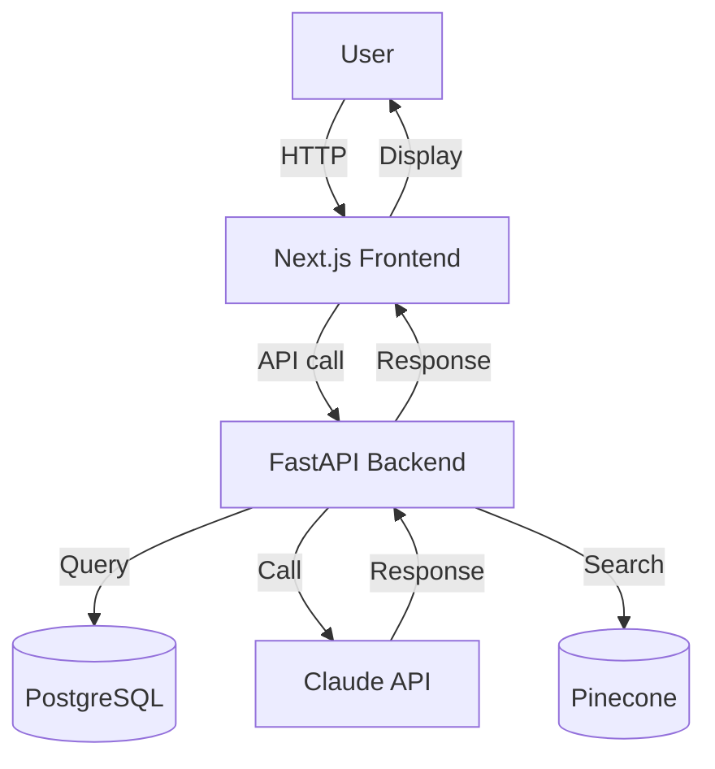

# Prototype Spec Template

> **Use**: Stage 2 output. Working demo validated with real users on real data.
>
> **Mandatory closure**: every prototype spec MUST end with a `## FDE Assurance Score` section (see [references/fde-trust-score.md](../references/fde-trust-score.md)). The held-out promotion gate from `scripts/scientific_search.py` is the Contradiction step; the eval baseline is the Verification step.

---

# [Project Name] — Prototype Specification

**Date**: [YYYY-MM-DD]
**Stage**: 2 of 4 (Prototyping)
**Build Duration**: [N days, target ≤20]

---

## 1. Goal

[1 paragraph: what we're proving or disproving with this prototype]

**Hypothesis**: [Specific, testable statement]

**Success criteria**: [Quantified, measurable]

---

## 2. Architecture

### 2.1 System Diagram (Mermaid)



### 2.2 Component Breakdown

| Component | Tech | Purpose | Notes |
|---|---|---|---|
| Frontend | Next.js 14 | User interface | shadcn/ui + Tailwind |
| Backend | FastAPI | API + orchestration | Async, Python 3.12 |
| Database | PostgreSQL 16 | Structured data | Prisma or Drizzle |
| LLM | Claude Sonnet 4.5 | Reasoning | Via Anthropic API |
| Vector DB | Pinecone | RAG search | Serverless tier |
| Cache | Redis | Sessions, rate limit | Upstash |
| Observability | Langfuse | LLM tracing | Free tier |

### 2.3 Data Flow

[Describe the request → response lifecycle, including failure paths]

### 2.4 Failure Modes

| Failure | Detection | Recovery |
|---|---|---|
| LLM API timeout | Health check | Retry with backoff, fallback to GPT-4o-mini |
| DB connection lost | Connection error | Reconnect, queue request |
| Rate limit hit | 429 response | Exponential backoff |
| Bad LLM output | Schema validation fails | Retry with feedback |

---

## 3. Eval Framework

### 3.1 Eval Strategy

| Layer | Tool | Purpose |
|---|---|---|
| Deterministic | Custom Python | Schema validation, regex checks |
| LLM-as-judge | Claude Sonnet 4.5 | Quality, relevance, safety |
| Human-in-the-loop | Label Studio | Edge cases, ground truth |

### 3.2 Success Metrics

| Metric | Target | Measurement |
|---|---|---|
| Accuracy | ≥X% | Held-out eval set |
| Latency p95 | <Xs | Production load test |
| Cost per task | <$X | Langfuse tracking |
| User satisfaction | ≥4/5 | Post-task survey |

### 3.3 Eval Set Design

```
Total: 200 cases
├── Happy path: 100 (50%)
├── Edge cases: 50 (25%)
├── Adversarial: 30 (15%)
└── Regression: 20 (10%)
```

### 3.4 Eval Pipeline

```bash
# Run evals
python scripts/evals_runner.py --eval-set data/eval_set.jsonl

# Output
# Pass rate: 87%
# By category: {happy_path: 95%, edge_cases: 78%, adversarial: 80%, regression: 85%}
# Failures: [list of 10 with details]
```

### 3.5 Scientific Search / Held-Out Promotion Gate

> Use when multiple architecture paths are plausible. The point is not to copy
> an external research runtime; it is to apply FDE-native scientific discipline
> before promotion.

**Hypothesis search command**:

```bash
python scripts/scientific_search.py \
  --problem [path/to/6q-problem.json] \
  --golden-set [path/to/held-out-golden-set.json] \
  --lessons-out .fde_lessons.json
```

**Candidate comparison**:

| Hypothesis | Development Score | Held-Out Score | Promotion Decision | Reason |
|---|---:|---:|---|---|
| H1 | [...] | [...] | PRUNED / PROMOTED | [...] |
| H2 | [...] | [...] | PRUNED / PROMOTED | [...] |
| H3 | [...] | [...] | PRUNED / PROMOTED | [...] |

**Promoted hypothesis**: [H# + architecture name]

**Held-out validation cases**:

| Case | Required Traits | Avoid Traits | Passed? | Evidence |
|---|---|---|---|---|
| [case-id] | [...] | [...] | Yes / No | [...] |

**Promotion rule**: Do not move to Stage 3 unless the selected candidate passes
the held-out gate. If no candidate passes, return to hypothesis generation or
reduce scope.

**Rejected-hypothesis lessons**: Link `.fde_lessons.json` and summarize the top
patterns that should update future playbooks/templates.

---

## 4. Implementation Plan (Days 11-30)

### Week 3 (Days 11-17)

- [ ] Day 11-12: Set up repo, CI/CD, observability
- [ ] Day 13-14: Build data ingestion + chunking + embeddings
- [ ] Day 15-16: Build RAG retrieval + reranking
- [ ] Day 17: Wire up LLM with prompt template

### Week 4 (Days 18-24)

- [ ] Day 18-19: Build eval framework, run baseline evals
- [ ] Day 20-21: Iterate on prompt, eval-driven
- [ ] Day 22-23: Build frontend (basic UI)
- [ ] Day 24: User testing session 1 (with 2-3 customers)

### Week 5 (Days 25-30)

- [ ] Day 25-26: Iterate based on user feedback
- [ ] Day 27-28: Run final evals, document results
- [ ] Day 29: Demo to customer stakeholders
- [ ] Day 30: Hand off prototype spec + eval results

---

## 5. User Testing Plan

### 5.1 Participants

| Role | Name | Why this person |
|---|---|---|
| Daily user 1 | [...] | Tests real workflow |
| Daily user 2 | [...] | Different angle |
| Decision-maker | [...] | Validates business value |

### 5.2 Test Protocol

For each participant:
1. **Setup** (5 min): Explain prototype, set expectations
2. **Task 1** (10 min): [specific real task on real data]
3. **Task 2** (10 min): [edge case]
4. **Feedback** (15 min): What worked, what didn't, what was missing

### 5.3 Capture Metrics

- Time per task
- Errors per task
- Subjective rating (1-5)
- Specific quotes (verbatim)

---

## 6. Risks & Open Questions

| Risk | Mitigation | Owner |
|---|---|---|
| [Risk 1] | [mitigation] | [name] |
| [Risk 2] | [mitigation] | [name] |

Open questions:
- [Q1]
- [Q2]

---

## 7. Definition of Done (for this stage)

- [ ] Working demo deployed (Vercel + Fly.io)
- [ ] Eval framework passing targets
- [ ] 3+ users tested, feedback captured
- [ ] Demo video recorded
- [ ] Prototype spec handed to customer

---

## 8. Handoff to Stage 3 (Production)

Once prototype is validated:
1. Production handoff plan (Stage 3)
2. Cost projections at scale
3. Security review checklist
4. Observability setup
5. Knowledge transfer plan

---

## FDE Assurance Score

Every prototype spec must close with a FDE Assurance Score (FDE Operating Principle #14, [DeepSCR protocol](../references/fde-trust-score.md)). Compute by hand:

```
FDE Assurance Score = 25×(Claim falsifiable, 1 sentence anchored on Q6)
            + 25×(≥3 failure modes documented in §2.4)
            + 30×(Evidence trail ≥1 concrete pointer: file/command/test/eval result)
            + 20×(Anti-patterns check passed — see SKILL.md §Anti-Patterns)
```

| Component | Score | Reason |
|---|---|---|
| Claim (falsifiable) | /25 | |
| Contradiction (≥3 failure modes) | /25 | |
| Evidence trail | /30 | |
| Anti-patterns check | /20 | |
| **Total** | **/100** | |

| Score | Verdict | Action |
|---|---|---|
| 85-100 | ✅ Certified | Advance to Stage 3 (Production Handoff) |
| 60-84 | ⚠ Needs revision | Address the lowest component, re-score |
| 0-59 | ❌ Rejected | Return to Stage 2 with a new hypothesis |

**SHA-256** (run `shasum -a 256 <this file>`): ______
**Verdict**: ______

---

**Next deliverable**: Production Handoff (Stage 3 output, if prototype passes user testing)
